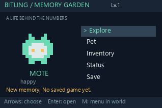
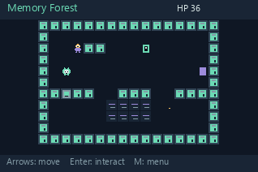
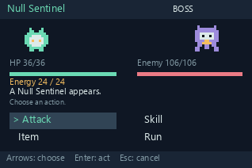

# Bitling-Nspire — Memory Garden

A tiny digital life and turn-based RPG inside a calculator's hidden memory. Care for **Mote**, restore three memory nodes, quiet the Null Sentinel, and bring a Memory Seed home.

Designed for the **first-generation TI-Nspire CX CAS**, existing **OS 3.2+**, stock Lua API 2.0. No Python on the calculator, Ndless, firmware flashing, CAS modification or network dependency.

**Status:** playable on the host simulator, .tns built on the computer. Physical Gen 1 execution and save/reopen have **not** been tested; use the [device acceptance checklist](docs/INSTALL.md#device-acceptance-checklist) before treating this as a verified handheld release.

These are 318×212 host renders of the actual Lua screens, not calculator photographs.

## Play

Calculator: transfer [dist/bitling.tns](dist/bitling.tns) into a new folder using TI-Nspire desktop software or TI-Nspire Computer Link. Open it as a normal document. [Installation and safety](docs/INSTALL.md) includes an official Script Editor fallback.

Desktop (Python 3.12 recommended; Tk required):

~~~powershell
python -m pip install -r requirements-dev.txt
python tools/simulate.py
~~~

In this Codex Windows workspace, the launcher selects the bundled Python:

~~~powershell
./tools/dev.ps1 -Task play
~~~

Arrows move/select, Enter interacts/confirms, Esc backs out, **M** opens the world menu, **Ctrl+S** persists the game document (or the simulator's own JSON). [All controls](docs/CONTROLS.md).

## MVP content

* Memory Forest, Graph Valley and Matrix Dungeon, each with collision, NPC, node, free healing terminal, hidden cache and enemies.
* Five regular enemies, one Boss, Attack/Skill/Item/Run, Factor/Solve/Graph/Analyze/Debug.
* Ten items, inventory, XP/levels, HP/energy/logic/focus, curiosity/bond.
* Offline pet reactions, idle/blink/walk/happy/hurt/attack pixel animation, active age and persistent progress.
* A beginning and achievable ending; keep playing after the garden is restored.

## Develop and build

~~~powershell
python tools/test.py
python tools/build.py
python tools/gallery.py
python tools/benchmark.py
# Optional desktop-only converter:
python tools/build.py --luna path/to/luna.exe
~~~

The build concatenates modular Lua into build/bitling.lua. The calculator does not need a module loader or filesystem access. Paste that bundle into TI's desktop Script Editor or package with [Luna](https://github.com/ndless-nspire/Luna). Development dependencies are never transferred to the calculator.

Optional local dependency installation: "./tools/dev.ps1 -Task install" puts libraries in ignored .devdeps/, leaving global Python packages alone.

## Limits

10 requested timer updates/sec; actual handheld FPS is unmeasured. Full-page viewport required; split panes show a layout notice. No audio, touchpad movement, off-device time simulation, remote AI, native extensions, Cache Ruins or Kernel Tower in this build. Battle snapshots resume safely outside combat; save completed fights to preserve rewards. The SAVE screen cannot force TI to save: **press Ctrl+S**.

## Project notes

[Technical feasibility](docs/TECHNICAL_MODEL.md) · [Architecture](docs/ARCHITECTURE.md) · [Game design](docs/GAME_DESIGN.md) · [Assets](docs/ASSETS.md) · [Roadmap](docs/ROADMAP.md) · [Verification](docs/TEST_REPORT.md) · [Development log](docs/DEVELOPMENT_LOG.md)

Original code and code-defined art use the repository's [Apache-2.0 license](LICENSE). Host dependencies and the optional desktop converter retain their respective licenses; converter binaries are not included.
